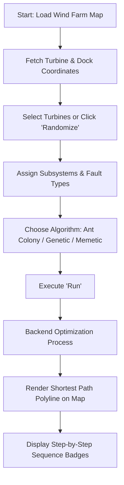

# 🐜 Wind Turbine Route Optimization Dashboard

[](https://reactjs.org/)
[](https://vitejs.dev/)
[](https://mui.com/)
[](https://leafletjs.com/)
[](https://tanstack.com/query/v4)
[](LICENSE)

An interactive, high-performance web dashboard built with **React** and **Vite** designed to solve complex route planning and maintenance dispatch problems across offshore and onshore wind turbine farms using metaheuristic optimization algorithms (**Ant Colony Optimization**, **Genetic Algorithms**, and **Memetic Algorithms**).

---

## 📸 Screenshots & Previews

### Optimize Routes Dashboard (Live Application)
Full view of the route optimization pipeline: parameter selection, dynamic data table with turbine fault details, interactive satellite map with the computed shortest route polyline, and the ordered execution sequence:


---

## ✨ Key Features

- 🗺️ **Interactive Geospatial Map & Satellite Imagery**:
  - High-resolution ArcGIS satellite imagery layer powered by **Leaflet** & **React-Leaflet**.
  - Dynamic map markers with custom visual indicators for dock stations (`Doca`) and offshore wind turbines.
  - Interactive tooltips, popups, and real-time neon green polyline paths displaying the optimized route traversal.

- ⚙️ **Metaheuristic Optimization Algorithms**:
  - Support for **Ant Colony Optimization (ACO)**, **Genetic Algorithm (GA)**, and **Memetic Algorithm (MA)**.
  - Configurable turbine targets with subsystem categorization (*Generator*, *Drive Train*, *Rotor Hub*, *Sensors*, *Electronic Control*, *Support & Housing*, *Mechanical Brake*, etc.) and fault severity levels (`Minor` vs `Major`).

- 🎲 **Batch Simulation & Randomizer**:
  - Dynamic turbine randomization tool with weighted fault distributions for rapid scenario generation and algorithmic benchmarking.

- 📋 **Data Grid & Route Sequence Flow**:
  - Searchable, sortable, and filterable data tables powered by `mui-datatables`.
  - Visual step-by-step breadcrumb sequence flow displaying the exact dispatch order from dock to turbines and back to dock.

- 🌓 **Theme Customization & Theming**:
  - Seamless Light / Dark mode toggle with persistent cookie state (`react-cookie`).
  - Modular styling built on Material UI (MUI v5) and custom themes.

---

## 🛠️ Tech Stack

| Category | Technology | Purpose |
| :--- | :--- | :--- |
| **Frontend Framework** | [React 18](https://react.dev/) | Component-based UI architecture |
| **Build Tool & Bundler** | [Vite 5](https://vitejs.dev/) | Instant HMR development and fast production bundling |
| **Component Library** | [Material UI (MUI v5)](https://mui.com/) | Responsive UI components, theme engine, and icons |
| **Maps & GIS** | [Leaflet](https://leafletjs.com/) & [React-Leaflet](https://react-leaflet.js.org/) | Geospatial canvas, coordinate projections, and polyline paths |
| **Data Management** | [TanStack React Query v4](https://tanstack.com/query/v4) | Server state caching, asynchronous query synchronization |
| **HTTP Client** | [Axios](https://axios-http.com/) | REST API communication with backend optimizer endpoints |
| **Data Tables** | [MUI-DataTables](https://github.com/gregnb/mui-datatables) | Advanced grid features (filtering, pagination, search) |
| **Routing** | [React Router DOM v6](https://reactrouter.com/) | Declarative client-side routing |
| **Data Visualization** | [ECharts for React](https://github.com/hustcc/echarts-for-react) | Analytical charts and telemetry visualizations |

---

## 🚀 Getting Started

### Prerequisites

Ensure you have the following installed on your machine:
- **Node.js**: `v18.0.0` or later
- **npm**: `v8.0.0` or later (or `yarn` / `pnpm`)
- **Backend Optimization API**: A running instance of the route optimization backend API (typically running on `http://127.0.0.1:8000`). You can use either the [FastAPI Backend](https://github.com/Klebiano/ant_colony_fast_api_backend) or the [Go/Rust Backend](https://github.com/Klebiano/ant_colony_golang_rust_backend).


### Installation

1. **Clone the repository**:
   ```bash
   git clone https://github.com/your-username/ant_colony_vite_js.git
   cd ant_colony_vite_js
   ```

2. **Install dependencies**:
   ```bash
   npm install
   ```

3. **Start the local development server**:
   ```bash
   npm run dev
   ```
   Open your browser and navigate to `http://localhost:5173` (or the port indicated in terminal output).

---

## 📦 Available Scripts

In the project directory, you can run:

| Command | Description |
| :--- | :--- |
| `npm run dev` | Runs the app in development mode with Hot Module Replacement (HMR). |
| `npm run build` | Bundles and optimizes the app for production into the `dist/` folder. |
| `npm run preview` | Locally previews the production build. |

---

## 🏗️ Project Structure

```text
ant_colony_vite_js/
├── docs/                     # Documentation assets and screenshots
│   └── images/               # UI preview screenshots for README
├── public/                   # Static assets (custom map markers, icons)
│   ├── dock-white.png        # Dock station marker icon
│   ├── wind-power-yellow.png # Wind turbine marker icon
│   └── logo.png              # Application logo
├── src/
│   ├── main.jsx              # Application entry point
│   ├── App.jsx               # Root provider setup (Theme, QueryClient, Routes)
│   ├── index.css             # Base stylesheet
│   ├── App.css               # Global theme and layout styles
│   ├── api/                  # Modular API clients (Axios & endpoints)
│   │   ├── dashboard/        # Turbine map data and optimization endpoints
│   │   ├── assets/           # Asset management & currency quote APIs
│   │   ├── transactions/     # Transaction records APIs
│   │   └── wallets/          # Wallet management APIs
│   ├── components/           # Reusable UI components
│   │   ├── TopBar/           # Application header navigation
│   │   ├── SideBar/          # Navigation drawer menu
│   │   ├── DarkModeButton/   # Light/Dark mode switcher
│   │   ├── Main/             # Shell layout container
│   │   └── Modal/            # Modular dialog modals
│   ├── pages/                # Page views
│   │   ├── dashboard/        # Route Optimizer Dashboard & Leaflet Map
│   │   ├── assets/           # Asset tracking page
│   │   ├── wallets/          # Wallet management page
│   │   └── transactions/     # Transaction history page
│   └── themes/               # ECharts and MUI theme definitions
│       └── Chalk.js          # Dark theme definition for ECharts
├── package.json              # Project dependencies and metadata
├── vite.config.js            # Vite configuration
└── README.md                 # Project documentation
```

---

## 🔄 Route Optimization Workflow



1. **Geospatial Mapping**: Coordinate sets for turbines and harbor docks are fetched via `getTurbineMapData()` and plotted onto the ArcGIS satellite map.
2. **Failure Configuration**: Target turbines requiring maintenance are added manually or automatically randomized with assigned subsystem faults and severity levels.
3. **Algorithm Execution**: A POST request containing the service targets is dispatched to the backend optimizer endpoint (`/ant-colony/run-route-optimizer/`).
4. **Visual Rendering**: The returned optimal traversal sequence (`turbine_order`) is rendered as an interactive path polyline on the Leaflet map and indexed in the sequence badges.

---

## 🔗 Backend Repositories & Ecosystem

This frontend dashboard communicates with specialized route optimization backend engines:

* 🐍 **Python / FastAPI Backend**: [ant_colony_fast_api_backend](https://github.com/Klebiano/ant_colony_fast_api_backend)
  * REST API developed with Python and FastAPI that serves geospatial wind turbine data and implements the Ant Colony Optimization (ACO), Genetic Algorithm (GA), and Memetic Algorithm (MA) route optimization solvers.
* ⚡ **Go & Rust Backend**: [ant_colony_golang_rust_backend](https://github.com/Klebiano/ant_colony_golang_rust_backend)
  * High-performance backend engine developed in Golang and Rust designed for high-concurrency computation, parallelized metaheuristic simulations, and accelerated route planning calculations.

---

## 📚 Academic Publications & Citations

This project is part of academic research on route planning and maintenance optimization for offshore wind farms using metaheuristic algorithms. The theoretical foundations, mathematical formulations, and benchmarking studies are detailed in the following research monographs:

### 1. Ant Colony Optimization (ACO) Study (UFERSA 2023)
* **Title**: *Desenvolvimento de plataforma WEB para planejamento de rotas na manutenção de parques eólicos offshore utilizando algoritmo da otimização da colônia de formigas: Estudo de Caso*
* **Authors**: Klebiano Kennedy da Silva Lima, Matheus da Silva Menezes
* **Institution**: Universidade Federal Rural do Semi-Árido (UFERSA) – Mossoró, RN, Brasil

#### ABNT Citation
```text
LIMA, Klebiano Kennedy da Silva; MENEZES, Matheus da Silva. Desenvolvimento de plataforma WEB para planejamento de rotas na manutenção de parques eólicos offshore utilizando algoritmo da otimização da colônia de formigas: Estudo de Caso. 2023. 13 f. Trabalho de Conclusão de Curso (Graduação em Engenharia Elétrica) – Universidade Federal Rural do Semi-Árido (UFERSA), Mossoró, 2023.
```

#### BibTeX
```bibtex
@monography{lima2023desenvolvimento,
  title={Desenvolvimento de plataforma WEB para planejamento de rotas na manuten{\c{c}}{\~a}o de parques e{\'o}licos offshore utilizando algoritmo da otimiza{\c{c}}{\~a}o da col{\^o}nia de formigas: Estudo de Caso},
  author={Lima, Klebiano Kennedy da Silva and Menezes, Matheus da Silva},
  year={2023},
  type={Trabalho de Conclus{\~a}o de Curso (Gradua{\c{c}}{\~a}o em Engenharia El{\'e}trica)},
  school={Universidade Federal Rural do Semi-{\'A}rido (UFERSA)},
  address={Mossor{\'o}, RN, Brasil}
}
```

### 2. Metaheuristics (GA & MA) Optimization Study (2024)
* **Title**: *Desenvolvimento de uma Plataforma Web para Otimização de Rotas de Manutenção em Parques Eólicos Offshore Utilizando Métodos Meta-heurísticos*
* **Authors**: Klebiano Kennedy da Silva Lima, Abdoulaye Aboubacari Mohamed
* **Program**: MBA em Data Science e Analytics – 2024


#### ABNT Citation
```text
LIMA, Klebiano Kennedy da Silva; MOHAMED, Abdoulaye Aboubacari. Desenvolvimento de uma Plataforma Web para Otimização de Rotas de Manutenção em Parques Eólicos Offshore Utilizando Métodos Meta-heurísticos. 2024. 16 f. Trabalho de Conclusão de Curso (Especialização em MBA em Data Science e Analytics) – 2024.
```

#### BibTeX
```bibtex
@monography{lima2024metaheuristicos,
  title={Desenvolvimento de uma Plataforma Web para Otimiza{\c{c}}{\~a}o de Rotas de Manuten{\c{c}}{\~a}o em Parques E{\'o}licos Offshore Utilizando M{\'e}todos Meta-heur{\'\i}sticos},
  author={Lima, Klebiano Kennedy da Silva and Mohamed, Abdoulaye Aboubacari},
  year={2024},
  type={Trabalho de Conclus{\~a}o de Curso (MBA em Data Science e Analytics)},
  note={Monografia de Especializa{\c{c}}{\~a}o}
}
```

---

## 🤝 Contributing

Contributions, issues, and feature requests are welcome!

1. Fork the project
2. Create your feature branch (`git checkout -b feature/AmazingFeature`)
3. Commit your changes (`git commit -m 'Add some AmazingFeature'`)
4. Push to the branch (`git push origin feature/AmazingFeature`)
5. Open a Pull Request

---

## 📄 License

This project is licensed under the MIT License - see the [LICENSE](LICENSE) file for details.

